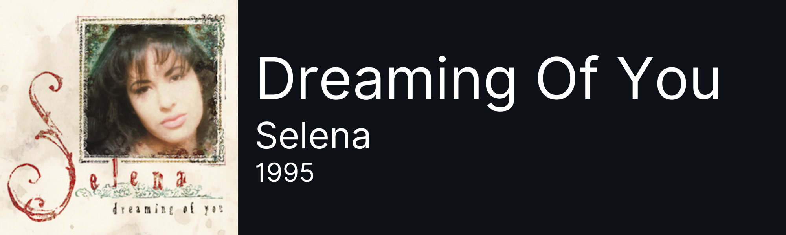

<h1 align='center'> ➜ matías (cepiclight) ✿ </h1>

***

hiii!! im matías, i'm from buenos aires, argentina and i just LOVE coding. this is supposed to be my portfolio (or at least where i keep track of 
all my projects). i am by no means professional but i'd like to study computer science in the near future

```python
from dataclasses import dataclass

@dataclass
class AboutMe:
    name: str = "matías"
    country: str = "Buenos Aires"
    fav_color: str = "maybe orange"
    email: str = "matiasezequielyanes@gmail.com"
    discord: str = ".albondiga."

about_me = AboutMe()
print(about_me)

```

<div align='center'>
    
    
</div>

***

<h1 align='center'> my current fav song </h1>

